# Password Generator

## Description

My motivation is to create a password generator for anyone who is interested in using it.

I build this project to help users in generating a password.

The project solves in which a user cannot have to spend time to generate a password.

I learned that there need to be debugging and testing constantly for the code to work.

## Table of Contents (Optional)

If your README is long, add a table of contents to make it easy for users to find what they need.

- [Installation](#installation)
- [Usage](#usage)
- [Credits](#credits)
- [License](#license)
- [Badges](#badges)
- [Features](#features)
- [How-to-contribute](#how-to-contributehowtocontribute)
- [Tests](#tests)

## Installation

To install, download the folder or clone the repo and open the index.html.

## Usage

When the page loads:
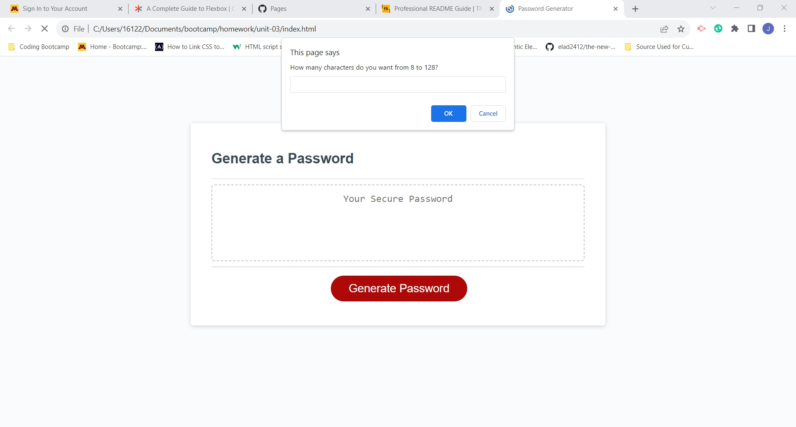

If using a lower number:

Prompt for using another number:
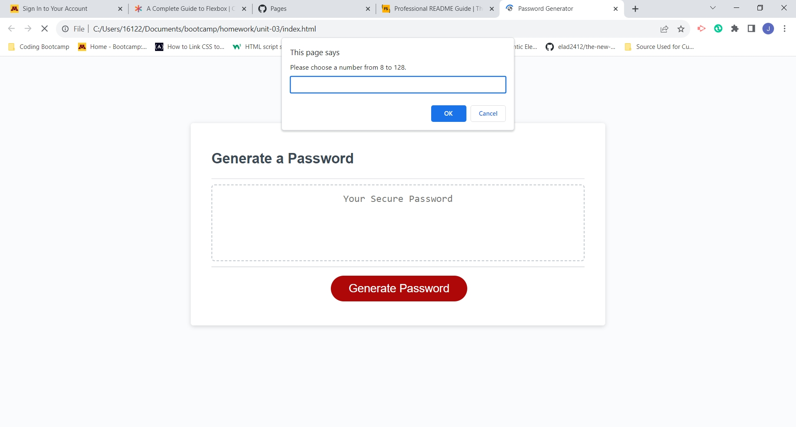

Confirmation to use lower case letters:
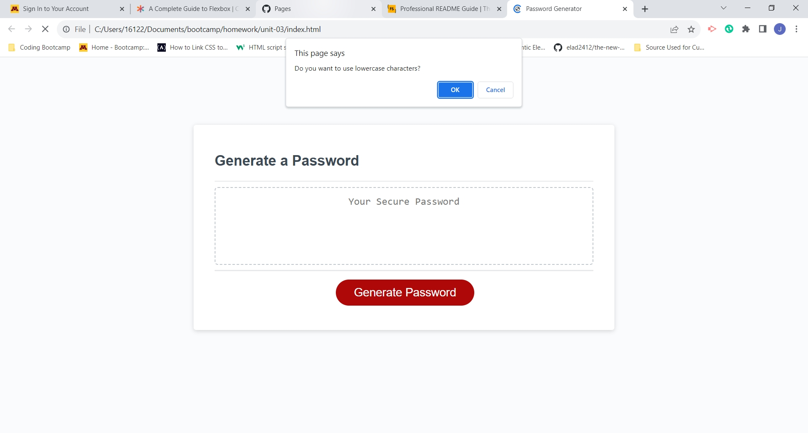

Confirmation to use upper case letters:
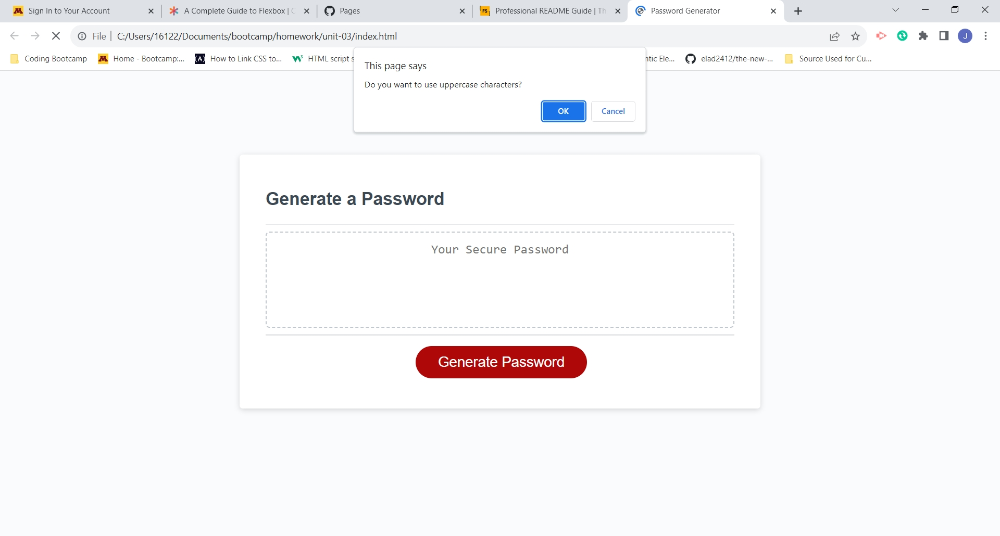

Confirmation to use numbers:

Confirmation to use special characters:
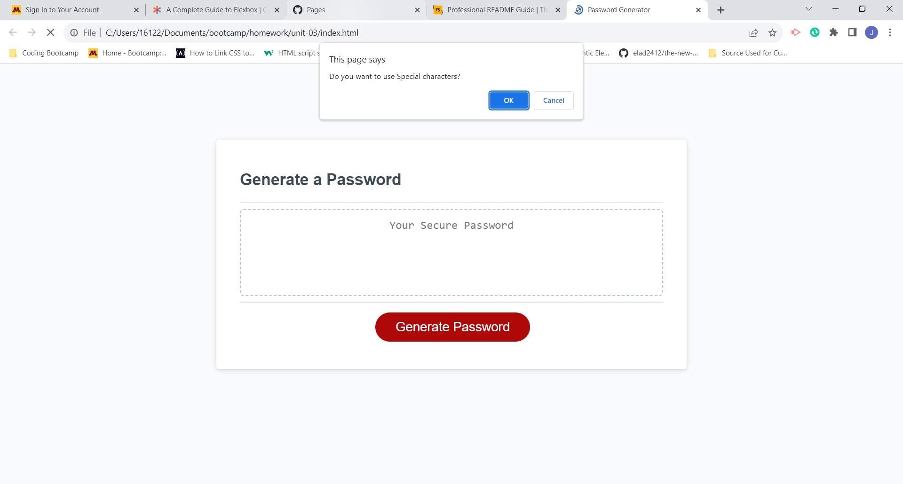

Result of first test using 8:
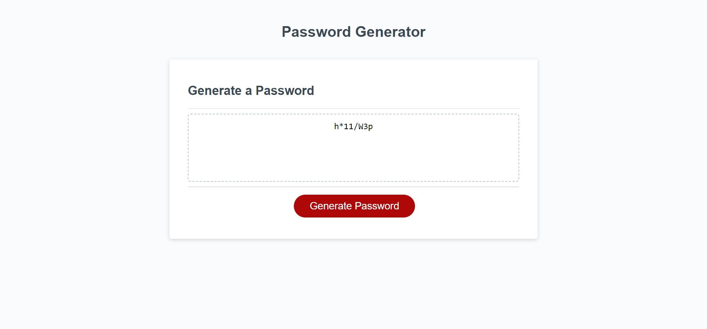

Using 127:
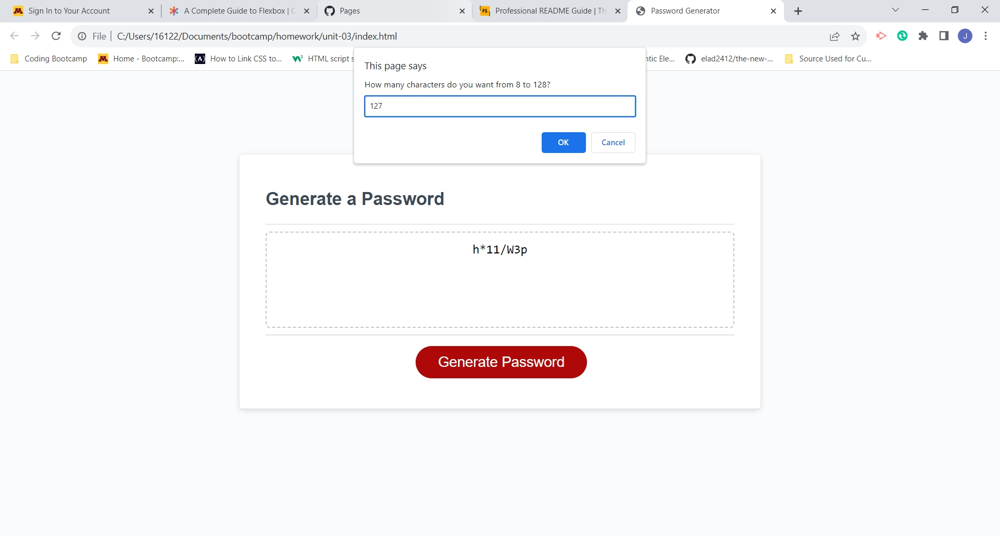

Result of second test:
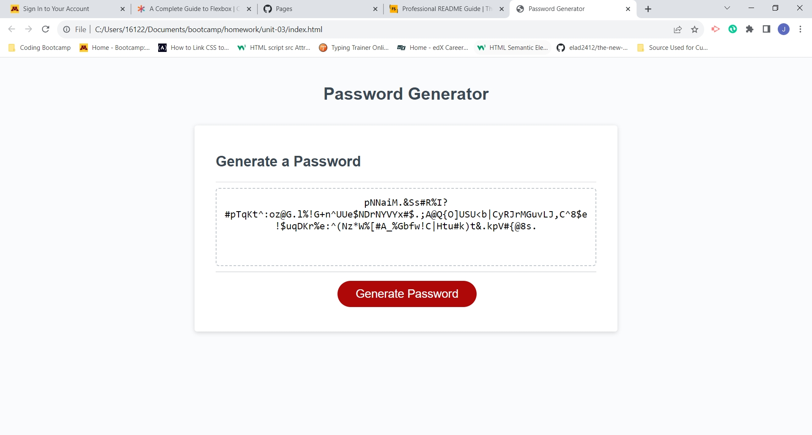

Result of third test using lowercase characters:

Result of fourth test using uppercase, number and special characters:
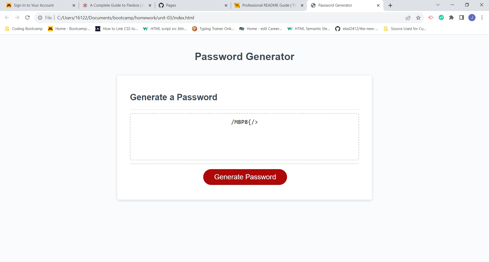

Result of fifth test using only special characters:
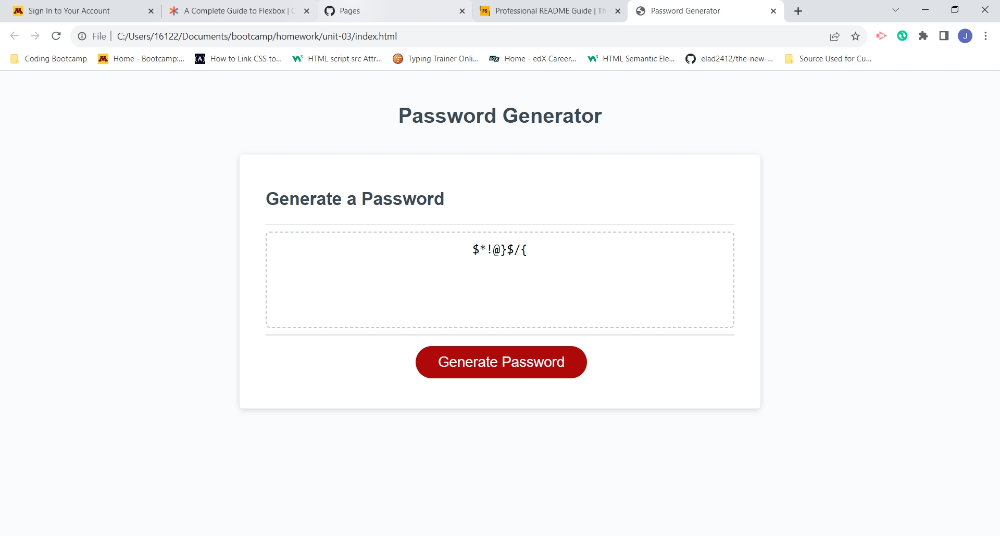

Result of sixth test generating 128 characters using all group of characters:
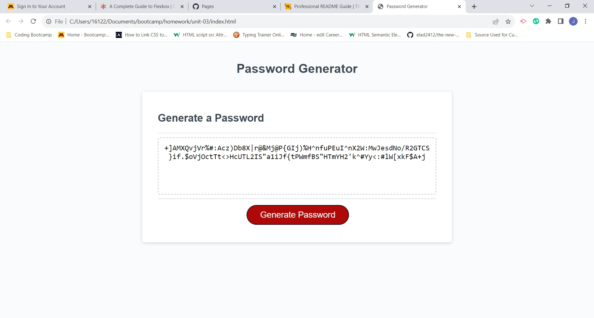

Result of using only numbers:
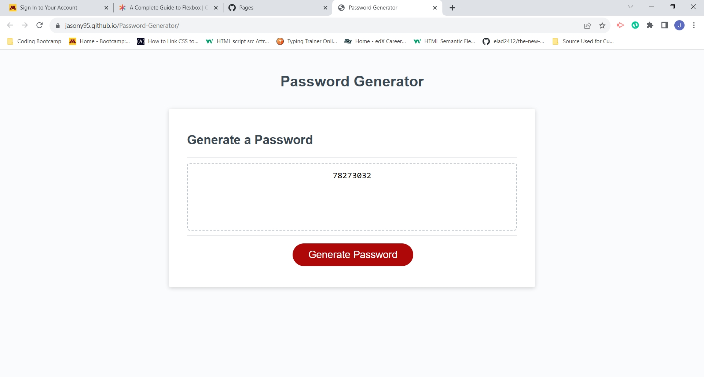

## Credits

Credits and sources:

- Used this link to learn how to shuffle an array in JavaScript: https://www.educative.io/answers/how-to-shuffle-an-array-in-javascript

- Used this link to learn how to convert an Array into a String without commas: https://dev.to/gaelgthomasarray-to-string-without-commas-in-javascript-4mg6#:~:text=In%20JavaScript%2C%20all%20arrays%20have,all%20the%20array%20elements%20concatenated.

- Used his link to learn how to check if a var is a string: https://stackoverflow.com/questions/6286542/how-can-i-check-if-a-var-is-a-string-in-javascript

- Used this link to learn how to test if a variable is a number and return true if it is not a number: https://www.w3schools.com/jsref/tryit.asp?filename=tryjsref_isnan2

- Used this link to find the Fisher-Yates Algorithm to shuffle the elements in an Array and used the algorithm with modification on it in line 137 to 143: https://dev.to/codebubb/how-to-shuffle-an-array-in-javascript-2ikj

## License

No license used.

## Badges

No Badges known.

## Features

- If user input nothing, a character that is not a number, there will be a prompt for the user to retype another character or string. If the user input a number lower than 8 or higher than 128, then the user is asked to input in another prompt window.

- User can choose lower case and/or upper case and/or number and/or special characters to add to the password. If the user does not choose any character type, the confirmation window will constantly states the user until the user choose at least one character group.

- Password can generate again even after the 1st password generation.

## How to Contribute

No need to contribute.

## Tests

Tests consist of clicking on the button to make sure that the password is generated correctly.